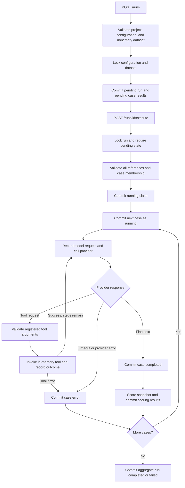

# Deterministic execution and observable traces

Execution extends the existing run, case-result, and tool-call records. Step 4
adds [separate deterministic scoring](scoring.md) after outcome persistence. No
external model service is called. All demo
data, policies, outputs, and failure scenarios are original fictional examples.

## Boundaries

- `providers/base.py`: `ModelProvider` protocol and typed requests, responses,
  messages, tool definitions, and optional token usage. Only observable final
  text or one tool request is accepted per response. Unknown provider fields,
  including reasoning metadata, are discarded by the response schema.
- `providers/fake.py`: stateless, deterministic scripts selected by the test
  input's `scenario`. The runner contains no scenario-specific branches.
- `tools/registry.py`: explicit tool registration, strict argument validation,
  and typed `ToolInvocation`. There is no dynamic import or code evaluation.
- `tools/support.py`: `get_order`, `check_refund_eligibility`, and
  `create_refund_request`. They read immutable fictional in-memory records and
  produce deterministic values. Refund requests do not create real refunds or
  mutate shared state. There is no filesystem or network access.
- `application/runner.py`: bounded `AgentRunner` loop. It knows provider/tool
  contracts and observation callbacks, not HTTP routes or database sessions.
- `application/evaluations.py`: reference validation, run creation, execution
  claims, `TraceRecorder`, short database transactions, and aggregate run status.
  A future worker can invoke this same service outside the API process.
- `application/redaction.py`: public trace projection and known-secret filtering.

## Execution flow



Configuration and dataset parent locks coordinate with the CRUD freeze rules.
Creating a run freezes those source records through the API. Creation rejects
empty datasets, mismatched projects, unavailable provider implementations, invalid
step limits, and datasets over 1000 cases. `parameters.max_steps` defaults to 8
and must be an integer from 1 through 12.

Execution locks the run row, verifies that all results are pending and match the
dataset, and commits `running` before calling a provider. Concurrent attempts
then receive 409. Running, completed, failed, and cancelled runs cannot execute
again; create a new run for a retry. Cases execute by test-case creation time and
UUID, matching the dataset collection's stable ordering.

There is no transaction around the whole evaluation or across a provider/tool
invocation. Each observation, tool record, and case outcome has a short commit.
Provider/tool failures become sanitized case errors, and later cases still run.
A PostgreSQL integration test uses separate connections and a blocked provider
to verify that earlier outcomes and the running claim are already visible.

## Execution is separate from scoring

New cases transition `pending → running → completed` on successful execution, or
`pending → running → error` on provider/tool/step-limit failure. `completed` does
not assert correctness: explicit `expectations` are evaluated by a separate service.
The legacy `expected_output` field is metadata, not an implicit assertion.
`pending → skipped` remains a domain transition, but there is no skip endpoint.

The original PostgreSQL enum also contains `passed` and `failed`. They remain
readable for compatibility with existing data and the initial migration, but
the domain validator rejects new transitions into those states. They are legacy
scoring states, not values produced by the runner. Deterministic scoring belongs in the
existing `ScoringResult` records and must not overwrite execution status. Removing
legacy enum values requires a separately designed historical-data migration.

Runs transition `pending → running → completed` if every executed case succeeds,
or `pending → running → failed` if any case has an execution error. The aggregate
response includes `total_cases` and `case_counts` for every enum value. A failed
run may still contain successfully completed cases. Their evaluation outcomes are
reported separately as passed, failed, or not_scored.

## Schema extension and migration

`ExecutionEvent` is the only new table. Existing `ToolCall.sequence` orders tools
relative to other tools; it cannot represent model responses interleaved with
tool requests/results. Events provide one total sequence per case with a unique
`(case_result_id, sequence)` constraint and an ordered `CaseResult.events`
relationship. Event kinds are database-constrained.

The new migration `0fe7f845cf6f` adds:

- `execution_events`: sanitized JSONB payload, kind, sequence, UTC start/finish
  timestamps, monotonic measured latency in milliseconds, and optional token counts.
- `case_results`: sanitized input snapshot, provider/model identifier, latency,
  optional input/output/total tokens, and structured `error_type`. Existing
  response/error/time columns are reused.
- `tool_calls`: argument-validation flag, structured error type, timestamps,
  and measured latency. Existing name, arguments, result, and call ID are reused.
- The unscored `completed` case enum value, using a transactional enum rebuild.

Existing rows retain their data; new trace metadata is nullable or has safe
defaults for legacy records. Downgrade removes the new trace table/columns and
maps `completed` to the old schema's `passed` terminal-success value. That fallback
is compatibility only, not evidence of scoring. Downgrading necessarily discards
new trace metadata; export it before downgrading a database you intend to retain.
Tests cover both empty and populated downgrade/reapply, including preserved
legacy output and enum values.

## APIs

- `POST /runs`: body contains `project_id`, `agent_configuration_id`, and
  `dataset_id`. Returns 201 with the persisted pending run and aggregate counts.
- `POST /runs/{run_id}/execute`: synchronous execution, returning 200 and the
  final run summary. Case execution errors appear in results, not as HTTP 500.
- `GET /runs/{run_id}`: run state, timestamps, sanitized aggregate error, counts.
- `GET /runs/{run_id}/results`: paginated case summaries using existing
  `limit`/`offset` conventions.
- `GET /results/{result_id}`: case summary, events sorted by event sequence, and
  tool calls sorted by tool sequence.

Missing resources return 404; duplicate execution returns 409; malformed IDs,
payloads, query parameters, incompatible references, or unsupported execution
configuration return 422. The existing CRUD and health endpoints are unchanged.
The Vite proxy maps `/api/*` to these backend paths.

## Trace example

For `{"scenario":"valid_tool"}`, the result's `response` is
`"Your fictional support request is complete."`, the case status is `completed`,
and usage is 22 input / 11 output / 33 total synthetic tokens. The ordered event
projection below omits record IDs, timestamps, and request message payloads for
readability; the API includes those fields and measured timing.

```json
[
  {"sequence":0,"kind":"case_started","payload":{"input":{"scenario":"valid_tool"}}},
  {"sequence":1,"kind":"model_request"},
  {"sequence":2,"kind":"model_response","input_tokens":10,"output_tokens":5,"total_tokens":15},
  {"sequence":3,"kind":"tool_request","payload":{"call_id":"fake-call-1","name":"get_order","arguments":{"order_id":"ORDER-1001"}}},
  {"sequence":4,"kind":"tool_result","payload":{"call_id":"fake-call-1","name":"get_order","arguments_validated":true,"output":{"order_id":"ORDER-1001","status":"delivered","days_since_delivery":12,"amount_cents":4200,"currency":"USD"},"error_type":null}},
  {"sequence":5,"kind":"model_request"},
  {"sequence":6,"kind":"model_response","input_tokens":12,"output_tokens":6,"total_tokens":18},
  {"sequence":7,"kind":"case_completed","payload":{"status":"completed"}}
]
```

Model-response and tool-result events carry the observed operation's timing span.
Requests/lifecycle markers are instantaneous observations with zero latency.
Event sequence, not timestamps, determines ordering. Case latency includes local
orchestration and trace commits; operation latency measures the provider or tool
call. Wall-clock timestamps are UTC, and latency uses a monotonic clock.

Counts come from the provider; they are never estimated from text. A case sums
each reported count across responses only when that count is supplied on every
observed response; otherwise that aggregate is null. A failed provider request
supplies no usage, so earlier reported usage may be only a partial accounting.
The fake provider's counts are fixed fixtures, not real tokenization. IDs,
timestamps, and latency vary between runs; semantic outputs and call order do not.

Unknown/invalid tool requests still appear in events and a tool-call record, but
have `arguments_validated=false` and empty validated `arguments`. The sanitized
requested arguments remain in the request event. Tools that fail after validation
retain validated arguments and record `tool_error`. Tool exceptions and provider
exceptions are never serialized verbatim.

## Offline demo

From `backend/`, with PostgreSQL running and `BENCHWARDEN_DATABASE_URL` configured:

```powershell
.\.venv\Scripts\python.exe -m alembic upgrade head
.\.venv\Scripts\python.exe -m benchwarden.demo
.\.venv\Scripts\python.exe -m benchwarden.demo --execute
```

On macOS/Linux, use `.venv/bin/python`. With Compose from the root:

```sh
docker compose up -d --wait db
docker compose run --rm backend python -m alembic upgrade head
docker compose run --rm backend python -m benchwarden.demo --execute
```

The seed reuses its named project/configuration/dataset on repeated calls. Each
`--execute` creates a new run. It intentionally contains eight scenarios:
`text_only`, `valid_tool`, `unknown_tool`, `invalid_arguments`, `timeout`,
`provider_error`, `tool_failure`, and `refund_flow`. Expect three completed cases,
five errors, and aggregate run status `failed`; this demonstrates recorded failures.
The scenario catalog is shared by the fake provider, demo, and tests.

After seeding, copy the printed IDs into an API request:

```powershell
$body = @{ project_id = '<project-id>'; agent_configuration_id = '<agent-id>'; dataset_id = '<dataset-id>' } | ConvertTo-Json
$run = Invoke-RestMethod http://localhost:8000/runs -Method Post -ContentType 'application/json' -Body $body
Invoke-RestMethod "http://localhost:8000/runs/$($run.id)/execute" -Method Post
$results = Invoke-RestMethod "http://localhost:8000/runs/$($run.id)/results"
Invoke-RestMethod "http://localhost:8000/results/$($results.items[0].id)"
```

## Redaction and limits

Trace capture uses an allowlisted provider response shape, omits system prompts
and configuration parameters from events, removes recognized sensitive/reasoning
keys recursively, and redacts known credential values and common bearer/API-key
patterns. API source writes reject recognized sensitive fields rather than storing
them. Older records inserted outside the API are not rewritten, but execution
sanitizes their trace snapshots. Raw exceptions, stack traces, vendor response
objects, and hidden reasoning are not stored by execution.

This is not arbitrary-secret detection: unlabelled sensitive prose cannot be
reliably identified by these rules. Use fictional, non-sensitive inputs. Real
providers will require explicit credential injection outside stored configuration
and adapter-specific observable-output projection before being enabled.

Execution is sequential and synchronous, with one tool request per response.
Timeouts are simulated immediately; there is no hard cancellation of a blocking
Python provider/tool. Only the bundled offline provider and trusted in-memory
tools are executable through the API. A process crash or database outage can
leave a run/case `running`; committed events and earlier outcomes survive, but
there is no recovery/resume endpoint. Automatic retry is intentionally blocked.
Event and outcome commits are separate, so a crash can leave a terminal trace
event without a committed terminal case state. Durable recovery belongs to a
later worker milestone.

No real LLM adapter, Celery, Redis worker, or new frontend screen is added.
Deterministic scorers and comparison now use the existing `ScoringResult` table;
see [scoring](scoring.md) for versioning, metric denominators, and API examples.
