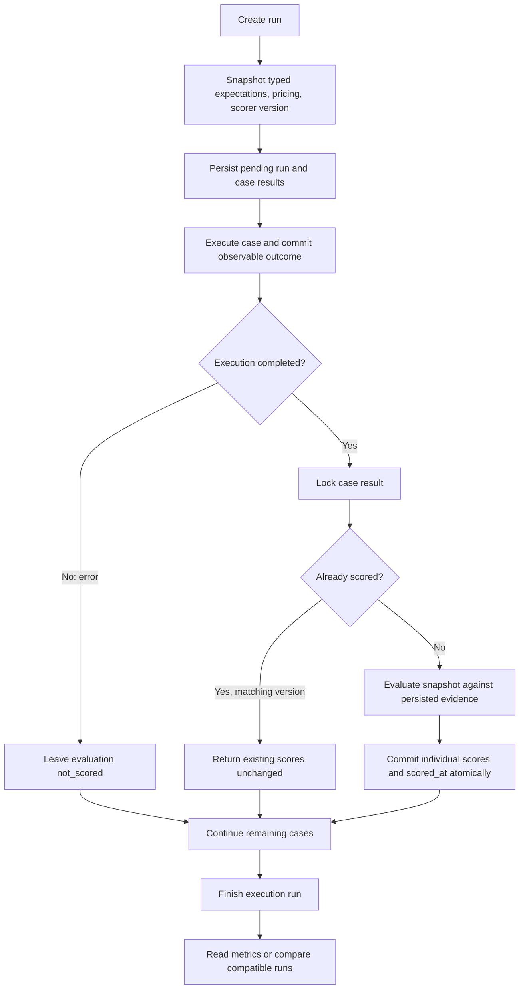

# Deterministic evaluation and experiment comparison

Scoring reads persisted, observable evidence. It does not call a model, modify a
trace, or change execution status. All examples below are fictional and offline.

## Contracts and flow

- `scoring/expectations.py`: discriminated, validated expectation schemas and the
  scoring contract version (`1`). Names are unique within a case; at most 64
  expectations are supported. Unknown fields/types, non-finite or negative
  thresholds, and duplicate names are rejected with 422.
- `scoring/scorers.py`: pure scorer functions and an explicit registry. A scorer
  receives one expectation and immutable evidence, and returns a verdict.
- `application/scoring.py`: short transactions, result locking, append-once
  persistence through the existing `ScoringResult` model, and explicit recovery.
- `scoring/metrics.py`: evaluation outcome and aggregates over persisted results.
- `application/comparison.py`: compatibility validation and read-only comparison.



`evaluation_outcome` is derived separately from the execution status:

- `passed`: execution is `completed`, there is at least one expectation, and all
  required scorer results exist and pass.
- `failed`: execution is `completed`, every required result exists, and at least
  one fails.
- `not_scored`: execution errored/is unfinished, no expectations were declared,
  historical snapshots are unavailable, or the scoring batch is incomplete.

An execution error is never scored, even if a partial output/tool trace exists.
Run execution status remains `completed` or `failed` according to execution
errors alone. Wrong answers do not turn a completed execution into an error.

Scoring automatically follows each committed completed execution. A result row
lock serializes concurrent scoring attempts. Scores, cost estimate, and UTC
`scored_at` are committed in one transaction per case. Repeat scoring returns
existing records unchanged. Inconsistent existing scores or unsupported versions
produce 409; no historical scores are replaced. A completed case without
expectations gets a processing timestamp and optional cost but stays `not_scored`.

`POST /runs/{id}/score` can recover scoring after an interruption once the run
has finished. It cannot recover a run stuck in `running` after a process crash.
Database outages and programming faults require operational recovery; they are
not converted to fabricated scoring failures.

## Declare expectations

Create or patch a draft test case with an `expectations` array:

```json
{
  "name": "Fictional order lookup",
  "input": {"scenario": "valid_tool"},
  "expected_output": "Your fictional support request is complete.",
  "expectations": [
    {"name":"answer","type":"exact_output","expected":"Your fictional support request is complete."},
    {"name":"normalized","type":"normalized_output","expected":"YOUR FICTIONAL SUPPORT REQUEST IS COMPLETE.","mode":"normalized"},
    {"name":"contains","type":"required_substring","expected":"fictional","case_sensitive":true},
    {"name":"tools","type":"tool_selection","expected":["get_order"],"mode":"exact"},
    {"name":"order","type":"tool_arguments","tool_name":"get_order","occurrence":0,"expected":{"order_id":"ORDER-1001"},"mode":"equality"},
    {"name":"partial","type":"tool_arguments","tool_name":"get_order","expected":{"order_id":"ORDER-1001"},"mode":"partial"},
    {"name":"latency","type":"max_latency","maximum_ms":1000},
    {"name":"cost","type":"max_cost","maximum_usd":"0.00005"}
  ]
}
```

`expected_output` remains existing fixture metadata and is not an implicit scorer.
The explicit expectation array is authoritative. Existing cases default to `[]`
and do not silently acquire correctness assertions. All declared expectations are
required; composition is logical AND. Names let multiple instances of a scorer
type coexist (for example, two required substrings).

Scorer semantics:

- Exact output: recursive JSON equality. Object key order is irrelevant; array
  order matters; booleans differ from numbers; numeric `1` equals `1.0`; missing
  keys differ from explicit null. JSON strings are not parsed as structured JSON.
- Normalized output: text only. `normalized` applies Unicode NFKC, case folding,
  and whitespace collapse/trim; punctuation is preserved. `case_insensitive`
  applies case folding only. Nontext outputs fail.
- Required substring: nonempty text, case sensitive by default; optional case
  folding. No regular expressions, tokenization, or whitespace normalization.
- Tool selection: `exact` compares the ordered list, including repeated calls.
  `required` allows extras and ignores order but preserves required multiplicity.
  An empty exact list asserts that no tools were requested.
- Tool arguments: select the zero-based occurrence of the named tool among its
  calls. Only validated arguments qualify. `equality` compares the whole object;
  `partial` recursively matches dictionary subsets. Arrays remain exact, including
  objects within arrays. Missing/unvalidated calls fail even for an empty subset.
- Maximum latency/cost: inclusive `observed <= maximum`; absent measurements fail
  rather than silently pass. Case latency includes local trace persistence and
  orchestration, so timing comparisons can vary even with the fake provider.

All current scorer values are binary numeric scores (`1.0`/`0.0`). Individual
results expose the expectation name as `scorer_name`, `scorer_type`,
`scorer_version`, `passed`, `value`, `explanation`, `expected`, `observed`, and
`details.category`. Result detail includes these alongside the unchanged trace:

```json
{
  "status": "completed",
  "evaluation_outcome": "passed",
  "scoring_results": [{
    "scorer_name":"order", "scorer_type":"tool_arguments", "scorer_version":"1",
    "passed":true, "value":1.0, "explanation":"Expectation satisfied.",
    "expected":{"order_id":"ORDER-1001"}, "observed":{"order_id":"ORDER-1001"},
    "details":{"category":"tool_arguments"}
  }]
}
```

## Optional USD pricing

An agent configuration accepts `pricing` (null clears it on a draft):

```json
{"pricing":{"currency":"USD","input_usd_per_million":"1","output_usd_per_million":"2"}}
```

These are configured rates, not fetched vendor prices or actual bills. They are
snapshotted when creating the run. Estimated cost is
`(input_tokens × input_rate + output_tokens × output_rate) / 1,000,000`, using
decimal arithmetic without rounding before comparison. Rates allow 12 fractional
digits; persisted costs use `NUMERIC(38,18)`; money is serialized as decimal
strings. USD is the only supported currency. Tool/cache/reasoning charges and
provider-specific billing are not modeled. Missing pricing or incomplete token
counts yields null cost. Execution errors are conservatively excluded from full
cost accounting because their usage may be partial. Zero configured prices are
valid and differ from missing prices.

## Run metric denominators

Metrics are readable during execution; they describe the current persisted state.
Rates are fractions from zero to one. Zero denominators return null.

- Total cases: all case results in the run, including unfinished/error cases.
- Completed executions and execution errors: counts by execution status.
- Scoreable cases: completed cases with nonempty expectation snapshots.
- Passed/failed cases: complete scoring batches with their derived outcome.
- Unscored cases: total minus passed minus failed, including execution errors.
- Evaluation coverage: `(passed + failed) / total`.
- Pass rate: `passed / scoreable`; an eligible batch awaiting scoring contributes
  to the denominator. Compare only fully scored finished runs.
- End-to-end success rate: `passed / total`. This exposes execution errors and
  absent assertions that a scoreable-only pass rate would exclude.
- Output correctness/tool selection/tool argument rates: per-case all-pass rate
  among fully scored cases declaring that category. Multiple expectations in a
  category do not give one case extra weight.
- Latency: median and nearest-rank p95 (`ceil(0.95 * n)`), using available case
  latencies including errors; `latency_cases` reports measurement coverage.
- Total tokens: sum only when every case completed and reported total usage;
  otherwise null. `known_total_tokens` includes all supplied counts (possibly
  partial for errors), and `token_usage_cases` counts complete-case coverage.
- Estimated cost: sum only with cost for every case; otherwise null.
  `known_cost_usd` and `cost_cases` expose the partial estimate and its coverage.
- Failure categories: count each failing case once per category; categories can
  overlap. Execution errors count only under `execution`. An absent category has
  zero failures, not a claim that it was evaluated.

## APIs and comparison

- `POST /runs/{id}/score`: idempotent scoring of eligible results in a finished
  run; returns metrics. Finished includes execution `completed` and `failed` runs.
- `GET /runs/{id}/metrics`: current metrics and coverage.
- `GET /results/{id}`: adds ordered scoring results, expectation snapshot,
  evaluation outcome, scoring timestamp, and cost to existing trace detail.
- `GET /runs/{id}/results`: summaries include evaluation outcome and cost.
- `GET /runs/{baseline_id}/compare/{candidate_id}`: metrics for both runs, deltas,
  failure-category count deltas, pricing-change and identical-case-set flags,
  and case classifications.

Comparison requires the same project and dataset UUID, non-null matching scoring
versions, compatible expectation and input snapshots for shared case IDs, finished
execution, and complete scoring of eligible cases. Different agent configurations
are allowed. Missing resources return 404, incompatible/unfinished runs return
409, malformed IDs return 422. Legacy runs without snapshots cannot be reliably
rescored or compared; create a new run.

Absolute deltas are candidate minus baseline. Percentage deltas are
`100 × (candidate - baseline) / abs(baseline)` and are null for zero/unknown
baselines. Rate absolute deltas are fractions (0.1 means ten percentage points).
Lower latency/cost is generally better; the API does not relabel signs as quality.
Different pricing snapshots are flagged, so price changes can be distinguished
from usage changes. Metric deltas cover each whole run; if externally authored
runs contain different case sets, their unmatched cases are explicitly listed
and aggregate deltas reflect different cohorts.

Matched cases report individual improved/regressed expectation names. Any
passing-to-failing assertion or completed-to-error execution makes a case
`regressed`; otherwise any failing-to-passing assertion or error-to-completed
execution makes it `improved`; otherwise `unchanged`. When assertions move both
ways, regression takes precedence and both lists are retained. Execution recovery
is an improvement even if the newly available output fails an expectation.
Missing case IDs are `unmatched`. Runs without any common cases are rejected.

## Migration and reproducible demo

Revision `2c2af13af5e5` adds JSONB expectations, expectation/pricing/version
snapshots, nullable scoring timestamp/cost, and explicit scorer type/explanation/
expected/observed fields to the existing scoring table. No table or status enum
is duplicated. Historical rows retain their data; absent snapshots remain null,
and old scores are labeled `legacy`. Downgrade preserves the original score
columns and execution trace but necessarily discards the new metadata; reapply
does not fabricate lost history. Back up retained databases before downgrading.

After startup, from `backend/` in PowerShell:

```powershell
.\.venv\Scripts\python.exe -m alembic upgrade head
$demo = .\.venv\Scripts\python.exe -m benchwarden.demo --scoring --execute | ConvertFrom-Json
$body = @{ project_id=$demo.project_id; agent_configuration_id=$demo.agent_configuration_id; dataset_id=$demo.dataset_id } | ConvertTo-Json
$candidate = Invoke-RestMethod http://localhost:8000/runs -Method Post -ContentType 'application/json' -Body $body
Invoke-RestMethod "http://localhost:8000/runs/$($candidate.id)/execute" -Method Post
Invoke-RestMethod "http://localhost:8000/runs/$($demo.run_id)/metrics"
Invoke-RestMethod "http://localhost:8000/runs/$($demo.run_id)/compare/$($candidate.id)"
```

The separately named scoring seed preserves existing execution-only demos. It
contains eight fictional cases: three pass, five execution errors stay unscored.
Expect pass rate 1, evaluation coverage/end-to-end success 0.375, and run execution
status `failed`. The rates are fictional test fixtures, not vendor pricing.

## Adding a scorer

1. Add a strict discriminated expectation schema and include it in `Expectation`.
2. Implement a pure function `(Expectation, Evidence) -> Verdict`; register its
   type in `SCORERS`. Return public evidence only, never secrets or reasoning.
3. Define its category and null/missing/type/boundary behavior. Add unit cases and
   API persistence tests. New categories are counted automatically; new named
   aggregate rates require an explicit `RunMetrics` field and denominator.
4. Advance `VERSION` for changed scoring semantics and retain implementations for
   old versions if historical rescoring is required. Currently only version 1 is
   executable; a version mismatch returns conflict rather than changing history.
5. Document the contract and update comparison compatibility tests. Do not change
   execution statuses or edit existing scores.

LLM judges, weighted/optional assertions, cross-dataset lineage, frontend screens,
real provider pricing adapters, and durable worker recovery remain deferred.
[CLI and CI gates](cli-ci.md) now enforce policies using these explicit coverage
and success denominators.
